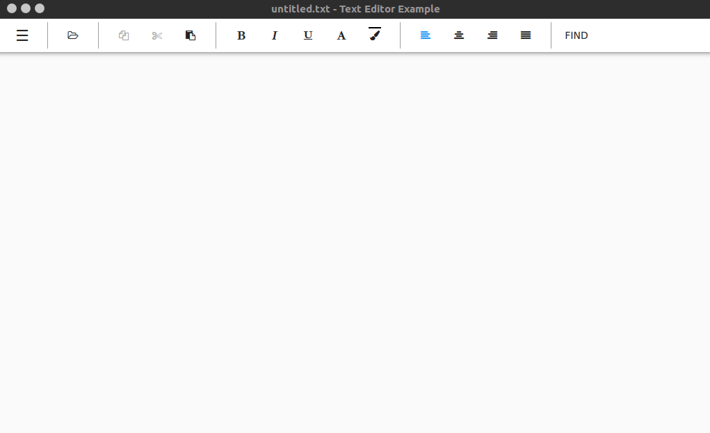
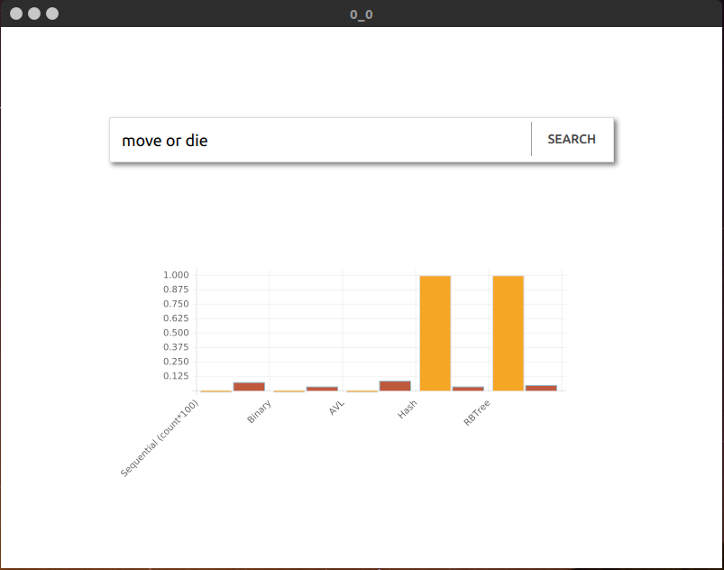

# SDU_DS_CDS  
山大数据结构课程设计：基于文档集合上的检索

## 总体实现
顺序查找、二分搜索（用移位代替除法）、红黑树、AVL树、哈希

抱歉留了个B+树的坑还没写完，学完数据库回来补上

在实现各个算法基础上，加入了算法运行时间比较以及搜索比较次数比较，从比较次数其实可以很清楚的看出算法的时间复杂度，比如五百个单词AVL树大概就是搜索8-9次，基本就是log2(500)

时间比较和次数比较整合了一个javascript的脚本，挺有名的一个库，很好用，简单的截图

#### 最初的界面，套了Qt给的例子里的文本编辑器，左侧有一个类似安卓抽屉一样的侧栏，里面是文件列表

#### 搜索界面

#### 比较算法界面,数据处理过，并不是真实的数据，比较大小就好

## 环境问题

Ubuntu16.04

QT 5.10.1

Qt Creator 4.5

## 以下是各种搜索算法简单的总结，如果我的代码以及文档帮助到了你，给个星吧谢谢
## The following is my summary of various search algorithms, a star, please.

### （一）顺序搜索
1. O(n)
2. 慢 操作次数太多
### （二）二分搜索
1. O(logn)
2. 可改进 (除法运算耗时)  移位运算
 mid = (left +right) / 2  －> mid = (left + right) >> 1 
3. 其他的改进方法：插值搜索　斐波那契搜索（更为智能的让left和right贴近真实值，但是需要字符串的加减）
### （三）哈希
1. Ｏ(1)
2. 字符串的哈希函数
3. 构造时间长
### （四）二叉搜索树系列
1. O(logn)
2. 基础的二叉搜索树
3. AVL树　极为严格的平衡规则
4. 红黑树　更为精细的平衡规则
### （五）B树系列
1. 为了更快的搜索，我们会将阶数设置的很大，这样层数就比较少，这一点上远远强于二叉搜索树
2. 广泛运用作各大数据库的索引机制
3. 从硬件角度来说，B树和B+树
4. B-树 (　可以在非叶子节点命中　)
5. B+树(　把所有数据放在叶子节点，只能在叶子节点命中　)　（有待实现）
6. B*树
### （六）TrieTree系列
1. 专门用于字符串搜索，搜索引擎的智能提示就是由TrieTree而来
2. 典型的空间换时间　Ｏ(26^n)
3. ２６路搜索树
